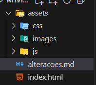

# DESIGN_TODO

## Alterações feitas no código

## Organização de arquivos
Para atender as boas práticas de desenvolvimento web, as tags script e style foram retiradas do corpo do arquivo html e criado um arquivo para melhor manutenção e alteração do código por parte do futuro desenvolvedor.

O código matinha todos os elementos (HTML, CSS e JavaScript no mesmo arquivo). Eu retirei as tags style e script que continham código e coloquei numa arquivo e pasta específica destinada para cada um dos arquivos na pasta assets. 

A estrutura atual ficou da seguinte forma:

* css/ para estilos (style.css);
* js/ para códigos em JavaScript (index.js);
* images/ para icones e imagens que serão utilizadas no projeto.|

Motivo para mudança: melhor organização do código e facilidade para futura escabilidade do projeto

## Alterações na estrutura html

O código html foi melhorado, incluindo tags semânticas como header e section, implementação de icones svg para o botão de adição e remoção de tarefas do aplicativo. 

Motivos para mudança: HTML semântico melhora a acessibilidade e a otimização de mecanismos de busca. Icones também melhoram a experiência do usuário ao utilizar a aplicação, deixando-a mais intuitiva e de fácil acesso. 

## Importar os arquivos para o index.html
Como boa prática, a página principal será renomeada para index.html. Além disso, os arquivos foram importados utilizando a tag link rel, juntamente com o caminho de cada arquivo.

## Melhorias na estilização

Para melhorar um pouco a visualização da aplicação, foi alterado seu estilo. Criei um arquivo css separado do corpo do html. Criei variaveis CSS para as cores, como forma de serem reutilizadas de maneira mais eficiente. Coloquei também um fundo escuro, botões estilizados com efeitos de hover e transições. Claro, melhor espaçamento entre os elementos. Aproveitando, coloquei também um contorno verde na aplicação e centralizei ela, utilizando uma div e uma classe container. Sendo assim, a nova interface permite com que a aplicação fiquei agradável e um pouco mais moderna. 

Motivos para mudança: Separação do CSS melhora a organização do código. Variáveis de cores permitem uma atualização e alteração do tema visual. 

## Separação do código javascript

Eu separei o código javascript do corpo do html como forma de permitir a melhor modularização do código, facilitando sua manutenção e reutilização. Um dos princípios fundamentais da ciência da computação é o princípio do dividir para conquistar: nós divididos uma aplicação em pequenos componentes como forma de auxiliar/facilitar sua manutenção e alterações para features futuras.

## Adicionado um icone na página
Motivo da mudança? Porque deixa mais estiloso. Ponto!

